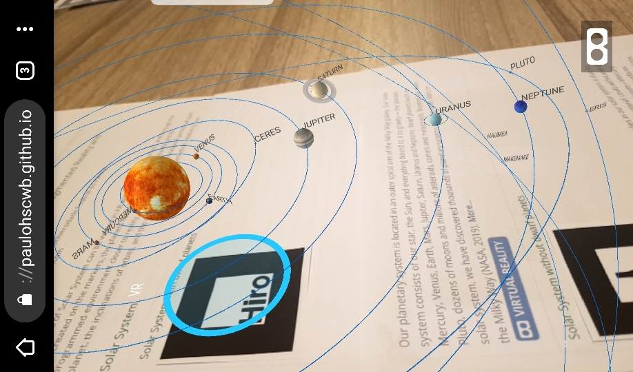

# Visualization of Solar System with Augmented Reality and Virtual Reality with A-frame
<i>author: Paulo Henrique Siqueira - Universidade Federal do Paraná</i>
  contact: <a href="#">paulohscwb@gmail.com</a>
  <a href="https://paulohscwb.github.io/sistema-solar/">versão em português</a>
   The planets of Solar System can be viewed in AR with the indicated markers, and through the links created on the markers, the planets can be seen in VR.
 The AR environment was created with the <b>Jerome Etienne</b> scripts: <a href="https://github.com/jeromeetienne/AR.js">AR.js - Augmented Reality for the Web</a>.
 The orbit scripts developed by <b>Till Hinrichs</b> were used on the VR pages: <a href="https://github.com/tizzle/aframe-orbit-controls-component">A-frame orbit controls component</a>.
 The information used was taken from NASA's website: <a href="https://nssdc.gsfc.nasa.gov/planetary/factsheet/">Planetary Fact Sheet</a>.
 The textures used on the planets were used from Solar System Scope site: <a href="https://www.solarsystemscope.com/textures/">Solar Textures</a>.
  To view the Solar System in AR, simply visit 

<a href="https://paulohscwb.github.io/solar-system/solar.html">https://paulohscwb.github.io/solar-system/solar.html</a>
 
with any browser with a webcam device (smartphone, tablet or notebook). 
 Access to the VR sites is done by clicking on the blue circle that appears on top of the marker.
  

<h3>Solar System</h3>
<h4>Solar System with dwarf planets</h4>

   ...
  
<h4>Solar System without dwarf planets</h4>

   ...
  

<h3>Planets</h3>
<h4>1. Mercury</h4>
 
   The smallest planet in our solar system and nearest to the Sun, Mercury is only slightly larger than Earth's Moon. From the surface of Mercury, the Sun would appear more than three times as large as it does when viewed from Earth, and the sunlight would be as much as seven times brighter. Despite its proximity to the Sun, Mercury is not the hottest planet in our solar system – that title belongs to nearby Venus, thanks to its dense atmosphere.
  
 <h4>2. Venus</h4>
 
   Second planet from the Sun and our closest planetary neighbor, Venus is similar in structure and size to Earth, but it is now a very different world. Venus spins slowly in the opposite direction most planets do. Its thick atmosphere traps heat in a runaway greenhouse effect, making it the hottest planet in our solar system—with surface temperatures hot enough to melt lead. Glimpses below the clouds reveal volcanoes and deformed mountains.
  
<h4>1. Mars</h4>
 
   ...
  
<h4>1. Jupiter</h4>
 
   ...
  
<h4>1. Saturn</h4>
 
   ...
  
<h4>1. Uranus</h4>
 
   ...
  
<h4>1. Eris</h4>
 
   ...
  
<h4>1. Haumea</h4>
 
   ...
  
<h4>1. Makemake</h4>
 
   ...
  
 <h4>1. Ceres</h4>
 
   ...
  
<h4>1. Pluto</h4>
 
   ...
  
<h4>1. Neptune</h4>
 
   ...
  
<h4>1. Earth</h4>
 
   ...
  
<h4>1. Sun</h4>
 
   ...
  
