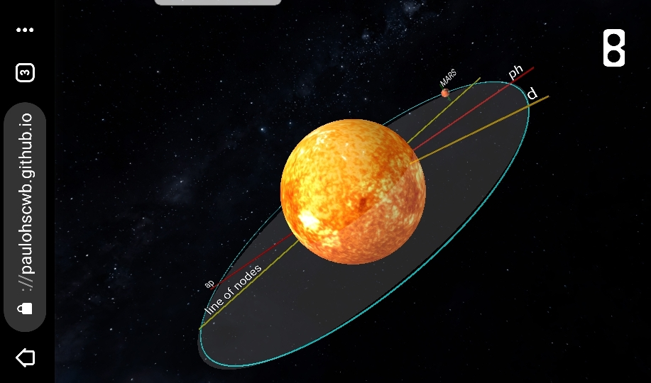

<link rel="stylesheet" href="../imagens/style.css">
<h2>Visualização do Sistema Solar com Realidade Aumentada e Realidade Virtual em A-frame</h2>
<b>desenvolvido por:</b> Paulo Henrique Siqueira - Universidade Federal do Paraná
  <b>contato:</b> <a href="#">paulohscwb@gmail.com</a>
  <a href="https://paulohscwb.github.io/solar-system/">english version</a>
   Os planetas do Sistema Solar podem ser visualizados em AR com os marcadores indicados, e através dos links criados nos marcadores, os planetas podem ser vistos em RV. Para tornar o ambiente programado em RV e RA mais próximo da realidade, foram incluídos os períodos orbital e de rotação de cada planeta, as inclinações das órbitas e as distâncias afélio e periélio em relação ao Sol.
    O ambiente AR foi criado com os scripts desenvolvidos por <b>Jerome Etienne</b>: <a href="https://github.com/jeromeetienne/AR.js" target="_blank">AR.js - Augmented Reality for the Web</a>.
 Os scripts de órbita desenvolvidos por <b>Kevin Ngo</b> foram usados nas páginas de RV: <a href="https://github.com/supermedium/superframe/tree/master/components/orbit-controls/" target="_blank"> Orbit controls for A-Frame</a>.
 Todas as informações sobre o sistema solar foram retiradas do site da NASA: <a href="https://solarsystem.nasa.gov/" target="_blank">https://solarsystem.nasa.gov/</a>. 
 O objetivo deste projeto é mostrar os planetas em RA e RV com a tecnologia A-frame.
 As texturas dos planetas foram utilizadas do site Solar System Scope: <a href="https://www.solarsystemscope.com/textures/" target="_blank">Solar Textures</a>.
  Para visualizar o Sistema Solar em RA, acesse o site: 

<a href="../solar.html" target="_blank">https://paulohscwb.github.io/solar-system/solar.html</a>
 
com qualquer navegador com um dispositivo de webcam (smartphone, tablet ou notebook). 
  

 O acesso aos sites de RV é feito clicando-se no círculo azul que aparece em cima de cada marcador.
  

  
Sistema Solar

<h4>Sistema Solar com os planetas anões</h4>

   Nosso sistema planetário está localizado em uma ramificação espiral externa da Via Láctea. O sistema solar consiste de nossa estrela, o Sol, e tudo ligado a ela pela gravidade - os planetas Mercúrio, Vênus, Terra, Marte, Júpiter, Saturno, Urano e Netuno, planetas anões como Plutão, dezenas de luas e milhões de asteróides, cometas e meteoros. Além do nosso próprio sistema solar, descobrimos milhares de sistemas planetários orbitando outras estrelas na Via Láctea. (NASA, 2019). <a href="https://solarsystem.nasa.gov/solar-system/our-solar-system/overview/" target="_blank">Mais sobre...</a>
  

 
 <h4>Sistema Solar sem os planetas anões</h4>

   A ordem e disposição dos planetas e outros corpos em nosso sistema solar são devido à própria formação do sistema solar. Mais próximo do Sol, apenas o material rochoso poderia suportar o calor quando o sistema solar era jovem. Por essa razão, os primeiros quatro planetas - Mercúrio, Vênus, Terra e Marte - são planetas terrestres. Eles são pequenos com superfícies sólidas e rochosas. Enquanto isso, materiais que estamos acostumados a ver como gelo, líquido ou gás se instalaram nas regiões mais externas do jovem sistema solar. A gravidade juntou esses materiais, onde encontramos os gigantes gasosos Júpiter e Saturno e os gigantes do gelo Urano e Netuno. <a href="https://solarsystem.nasa.gov/solar-system/our-solar-system/in-depth/" target="_blank">Mais sobre...</a>
 O sistema solar sem planetas anões Plutão, Ceres, Makemake, Haumea e Eris pode ser visto no seguinte link de RV.
  

<a href="#p1" class="topo">voltar ao topo</a>

  
Planetas

<h4>1. Mercúrio</h4>
 
   O menor planeta do nosso sistema solar e mais próximo do Sol, Mercúrio é apenas um pouco maior que a Lua da Terra. Da superfície de Mercúrio, o Sol aparece três vezes maior do que quando visto da Terra, e a luz do sol é sete vezes mais brilhante. Apesar de sua proximidade com o Sol, Mercúrio não é o planeta mais quente do nosso sistema solar - esse título pertence à vizinha Vênus, graças à sua atmosfera densa.
 <b>Dia:</b> 59 dias terrestres | <b>Ano:</b> 88 dias terrestres | <b>Raio:</b> 2.439,7 km | <b>Tipo:</b> Terrestre | <b>Luas:</b> 0 | <a href="https://solarsystem.nasa.gov/planets/mercury/overview/" target="_blank">Mais sobre...</a>
 

<h4>2. Vênus</h4>
 
   Segundo planeta do sistema Solar e nosso vizinho mais próximo, Vênus é semelhante em estrutura e tamanho à Terra, mas trata-se de um mundo muito diferente. Vênus gira lentamente na direção oposta à maioria dos planetas. Sua atmosfera espessa absorve o calor em um efeito estufa, tornando-o o planeta mais quente do nosso sistema solar - com temperaturas superficiais quentes o suficiente para derreter o chumbo. Paisagens abaixo das nuvens revelam vulcões e montanhas deformadas.
 <b>Dia:</b> 243 dias terrestres | <b>Ano:</b> 225 dias terrestres | <b>Raio:</b> 6.052 km | <b>Tipo:</b> Terrestre | <b>Luas:</b> 0 | <a href="https://solarsystem.nasa.gov/planets/venus/overview/" target="_blank">Mais sobre...</a>
  

 
 <h4>3. Terra</h4>
 
   Nosso planeta o terceiro planeta do Sistema Solar e o único lugar que conhecemos até agora que é habitado. Enquanto a Terra é apenas o quinto maior planeta do sistema solar, é o único mundo em nosso sistema solar com água líquida na superfície. Apenas um pouco maior que a vizinha Vênus, a Terra é o maior dos quatro planetas mais próximos do Sol, todos feitos de rocha e metal. O nome Terra tem pelo menos 1.000 anos de idade. Todos os planetas, com exceção da Terra, receberam nomes de deuses e deusas gregos e romanos. No entanto, o nome Terra é uma palavra germânica, que significa simplesmente "o solo".
 <b>Dia:</b> 23,9 horas | <b>Ano:</b> 365,25 dias | <b>Raio:</b> 6.371 km | <b>Tipo:</b> Terrestre | <b>Luas:</b> 1 | <a href="https://solarsystem.nasa.gov/planets/earth/overview/" target="_blank">Mais sobre...</a>
  

 
 <h4>4. Marte</h4>
 
   O quarto planeta do sistema solar, Marte é um mundo deserto, frio e poeirento, com uma atmosfera muito fina. Este planeta dinâmico tem estações, calotas polares, cânions e vulcões extintos - evidência de um passado ainda mais ativo. Marte é um dos corpos celestes mais explorados em nosso sistema solar, é o único planeta para o qual enviamos expedições para percorrer a sua superfície. A NASA tem atualmente três espaçonaves em órbita, um rover e um lander na superfície e outro rover em construção na Terra. A Índia e a ESA (Agência Espacial Européia) também possuem espaçonaves na órbita de Marte. Esses exploradores robóticos encontraram muitas evidências de que Marte era muito mais úmido e quente, com uma atmosfera mais espessa bilhões de anos atrás.
 <b>Dia:</b> 24.6 horas | <b>Ano:</b> 687 dias terrestres | <b>Raio:</b> 3,390 km | <b>Tipo:</b> Terrestre | <b>Luas:</b> 2 | <a href="https://solarsystem.nasa.gov/planets/mars/overview/" target="_blank">Mais sobre...</a>
  

 
 <h4>5. Júpiter</h4>
 
   Júpiter tem uma longa história que surpreende os cientistas - desde 1610, quando Galileo Galilei encontrou as primeiras luas além da Terra. Essa descoberta mudou a maneira como vemos o universo. Quinto planeta do Sistema Solar, Júpiter é, de longe, o maior planeta - mais de duas vezes mais massivo que todos os outros planetas combinados. As listras e os redemoinhos familiares de Júpiter são na verdade nuvens frias e ventosas de amônia e água, flutuando em uma atmosfera de hidrogênio e hélio. A icônica Grande Mancha Vermelha de Júpiter é uma tempestade gigante, maior que a Terra, que tem durado centenas de anos.
 <b>Dia:</b> 9,92496 horas | <b>Ano:</b> 4.333 dias terrestres | <b>Raio:</b> 69.911 kilometers | <b>Tipo:</b> Gigante gasoso | <b>Luas:</b> 79 | <a href="https://solarsystem.nasa.gov/planets/jupiter/overview/" target="_blank">Mais sobre...</a> 
  

 
 <h4>6. Saturno</h4>
 
   Saturno é o sexto planeta do sistema solar e o segundo maior planeta. Adornado com milhares de lindos anéis, Saturno é único entre os planetas. Não é o único planeta que tem anéis - feitos de pedaços de gelo e rocha - mas nenhum é tão espetacular ou tão complexo quanto Saturno. Como o companheiro gigante de gás Júpiter, Saturno é uma enorme bola feita principalmente de hidrogênio e hélio.
 <b>Dia:</b> 10,7 horas | <b>Ano:</b> 29 anos terrestres | <b>Raio:</b> 58.232 km | <b>Tipo:</b> Gigante gasoso | <b>Luas:</b> 53 | <a href="https://solarsystem.nasa.gov/planets/saturn/overview/" target="_blank">Mais sobre...</a> 
 

<h4>7. Urano</h4>
 
   O primeiro planeta encontrado com a ajuda de um telescópio, Urano foi descoberto em 1781 pelo astrônomo William Herschel, embora ele originalmente pensasse que era um cometa ou uma estrela. Dois anos depois, o objeto foi universalmente aceito como um novo planeta, em parte devido às observações do astrônomo Johann Elert Bode. Herschel tentou, sem sucesso, nomear sua descoberta como Georgium Sidus e depois Rei George III. Ao invés disso, o planeta recebeu o nome de Urano, o deus grego do céu, como sugerido por Johann Bode.
 <b>Dia:</b> 17 horas e 14 minutos | <b>Ano:</b> 84 anos terrestres | <b>Raio:</b> 25.362 km | <b>Tipo:</b> Gigante de gelo | <b>Luas:</b> 27 | <a href="https://solarsystem.nasa.gov/planets/uranus/overview/" target="_blank">Mais sobre...</a> 
  

 
 <h4>8. Netuno</h4>
 
   Escuro, frio e atingido por ventos supersônicos, o gigante do gelo Netuno é o oitavo e mais distante planeta do nosso sistema solar. Mais de 30 vezes mais distante do Sol do que a Terra, Netuno é o único planeta em nosso sistema solar que não é visível a olho nu e o primeiro previsto pela matemática antes de sua descoberta. Em 2011, Netuno completou sua primeira órbita completa de 165 anos desde sua descoberta em 1846. A Voyager 2 da NASA é a única espaçonave que visitou Netuno de perto, passou em 1989 em seu caminho para fora do sistema solar.
 <b>Dia:</b> 16 horas | <b>Ano:</b> 165 anos terrestres | <b>Raio:</b> 24,622 km | <b>Tipo:</b> Gigante de gelo | <b>Luas:</b> 13 | <a href="https://solarsystem.nasa.gov/planets/neptune/overview/" target="_blank">Mais sobre...</a>
  

<a href="#p2" class="topo">voltar ao topo</a>

 

  
Planetas anões

<h4>1. Plutão</h4>
 
   Plutão é um mundo complexo e misterioso com montanhas, vales, planícies, crateras e talvez geleiras. Descoberto em 1930, Plutão foi por muito tempo considerado o nono planeta do nosso sistema solar. Mas depois da descoberta de mundos intrigantes semelhantes, mais profundos no distante cinturão de Kuiper, Plutão gelado foi reclassificado como um planeta anão. Plutão é orbitado por cinco luas conhecidas, a maior das quais é Charon. Charon tem cerca de metade do tamanho de Plutão, tornando-se o maior satélite em relação ao planeta que ele orbita em nosso sistema solar. Plutão e Caronte são freqüentemente chamados de "planetas duplos". O nome Plutão é considerado uma homenagem a um deus romano do submundo.
 <b>Dia:</b> 153 horas | <b>Ano:</b> 248 anos terrestres | <b>Raio:</b> 1.151 kilometers | <b>Tipo:</b> Anão | <b>Luas:</b> 5 | <a href="https://solarsystem.nasa.gov/planets/dwarf-planets/pluto/overview/" target="_blank">Mais sobre...</a>
  

<h4>2. Ceres</h4>
 
   O planeta anão Ceres é o maior objeto no cinturão de asteróides entre Marte e Júpiter e o único planeta anão localizado no interior do sistema solar. Foi o primeiro membro do cinturão de asteróides a ser descoberto quando Giuseppe Piazzi o viu em 1801. Quando Dawn chegou em 2015, Ceres se tornou o primeiro planeta anão a receber a visita de uma espaçonave. Chamada de asteróide por muitos anos, Ceres é muito maior e tão diferente de seus vizinhos rochosos que os cientistas o classificaram como um planeta anão em 2006. Embora Ceres tenha 25% da massa total do cinturão de asteróides, o pequeno Plutão ainda é 14 vezes mais maciço. Ceres é uma homenagem à deusa romana do milho e das colheitas. A palavra cereal vem do mesmo nome.
 <b>Dia:</b> 9 horas | <b>Ano:</b> 1.682 dias terrestres | <b>Raio:</b> 476 km | <b>Tipo:</b> Anão | <b>Luas:</b> 0 | <a href="https://solarsystem.nasa.gov/planets/dwarf-planets/ceres/overview/" target="_blank">Mais sobre...</a>
  

 
 <h4>3. Makemake</h4>
 
   Junto com outros planetas anões Plutão, Eris e Haumea, Makemake está localizado no Cinturão de Kuiper, uma região fora da órbita de Netuno. Um pouco menor que Plutão, Makemake é o segundo objeto mais brilhante no Cinturão de Kuiper, visto da Terra (enquanto Plutão é o mais brilhante). Demora cerca de 305 anos terrestres para este planeta anão fazer uma viagem ao redor do sol. Makemake ocupa um lugar importante na história dos estudos do sistema solar porque - junto com Eris - foi um dos objetos cuja descoberta levou a União Astronômica Internacional a reconsiderar a definição de um planeta e a criar o novo grupo de planetas anões. Seu nome é uma homenagem ao  deus Rapanui da fertilidade.
 <b>Dia:</b> 2,5 horas | <b>Ano:</b> 305,34 anos terrestres | <b>Raio:</b> 715 km | <b>Tipo:</b> Anão | <b>Luas:</b> 0 | <a href="https://solarsystem.nasa.gov/planets/dwarf-planets/makemake/in-depth/" target="_blank">Mais sobre...</a>
  

 
 <h4>4. Haumea</h4>
 
   Originalmente designado como 2003 EL61 (e apelidado de Santa por uma equipe de descoberta), Haumea fica no cinturão de Kuiper e é aproximadamente do mesmo tamanho de Plutão. Haumea é um dos grandes objetos de rotação mais rápida do nosso sistema solar. Seu giro rápido distorce a forma de Haumea, fazendo com que este planeta pareça uma bola de futebol americano. Duas equipes reivindicam crédito por descobrir Haumea citando evidências de observações feitas em 2003 e 2004. O Gazetteer of Planetary Nomenclature da União Astronômica Internacional lista o local da descoberta como Sierra Nevada Observatory na Espanha em 7 de março de 2003, mas nenhum descobridor oficial está listado. O nome Haumea é uma homenagem a deusa havaiana da fertilidade.
 <b>Dia:</b> 4 horas | <b>Ano:</b> 285 anos terrestres | <b>Raio:</b> 620 km | <b>Tipo:</b> Anão | <b>Luas:</b> 2 | <a href="https://solarsystem.nasa.gov/planets/dwarf-planets/haumea/in-depth/" target="_blank">Mais sobre...</a>
  

 
 <h4>5. Eris</h4>
 
   Eris é um dos maiores planetas anões conhecidos no nosso sistema solar. É aproximadamente do mesmo tamanho que Plutão, mas está três vezes mais distante do Sol. Eris primeiro pareceu ser maior que Plutão. Isso desencadeou um debate na comunidade científica que levou à decisão da União Astronômica Internacional em 2006 para esclarecer a definição de um planeta. Plutão, Eris e outros objetos similares são agora classificados como planetas anões. Originalmente designado 2003 UB313 (e apelidado de Xena pela sua equipe de descoberta), o nome Eris é uma homenagem a antiga deusa grega da discórdia e conflitos. O nome se encaixa desde que Eris permanece no centro de um debate científico sobre a definição de um planeta. Eris foi descoberto em 21 de outubro de 2003 por M. E. Brown, C. A. Trujillo e D. Rabinowitz no Observatório de Palomar.
 <b>Dia:</b> 25,9 horas | <b>Ano:</b> 557 anos terrestres | <b>Raio:</b> 1.163 km | <b>Tipo:</b> Anão | <b>Luas:</b> 1 | <a href="https://solarsystem.nasa.gov/planets/dwarf-planets/eris/in-depth/" target="_blank">Mais sobre...</a>
  

<a href="#p3" class="topo">voltar ao topo</a>

  
O Sol

 
   O Sol - coração do nosso sistema solar - é uma estrela anã amarela, uma bola quente de gases incandescentes. Sua gravidade mantém o sistema solar unido, mantendo tudo, desde os maiores planetas até as menores partículas de detritos em sua órbita. Correntes elétricas no Sol geram um campo magnético que é conduzido através do sistema solar pelo vento solar - um fluxo de gás eletricamente carregado saindo do Sol em todas as direções. A conexão e as interações entre o Sol e a Terra impulsionam as estações do ano, as correntes oceânicas, o clima, os cinturões de radiação e as auroras. Embora seja especial para nós, existem bilhões de estrelas como o nosso Sol espalhadas pela Via Láctea.
  <b>Distância da Terra:</b> 149,6 milhões de km ou 1 unidade astronômica <b>Raio:</b> 695.508 km | <b>Tipo de estrela:</b> Anã amarela | <a href="https://solarsystem.nasa.gov/solar-system/sun/in-depth/" target="_blank">Mais sobre...</a>
  

<a href="#p4" class="topo">voltar ao topo</a>

  Solar System by <a xmlns:cc="http://creativecommons.org/ns#" href="https://paulohscwb.github.io/solar-system/" property="cc:attributionName" rel="cc:attributionURL">Paulo Henrique Siqueira</a> is licensed with a license <a rel="license" href="http://creativecommons.org/licenses/by-nc-nd/4.0/">Creative Commons Attribution-NonCommercial-NoDerivatives 4.0 International</a>.

<h4>Como citar este trabalho:</h4> 

Siqueira, P.H., "Solar System". Disponível em: <https://paulohscwb.github.io/solar-system/>, Setembro de 2019.

